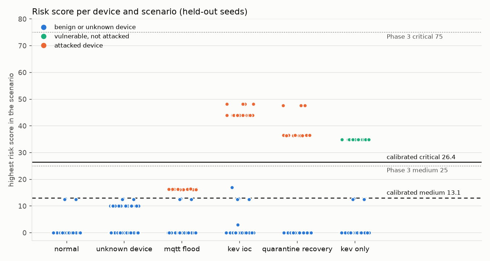
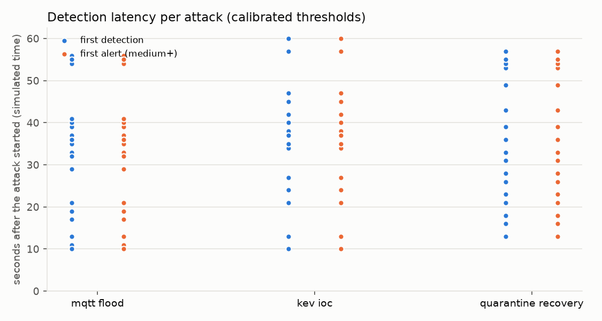
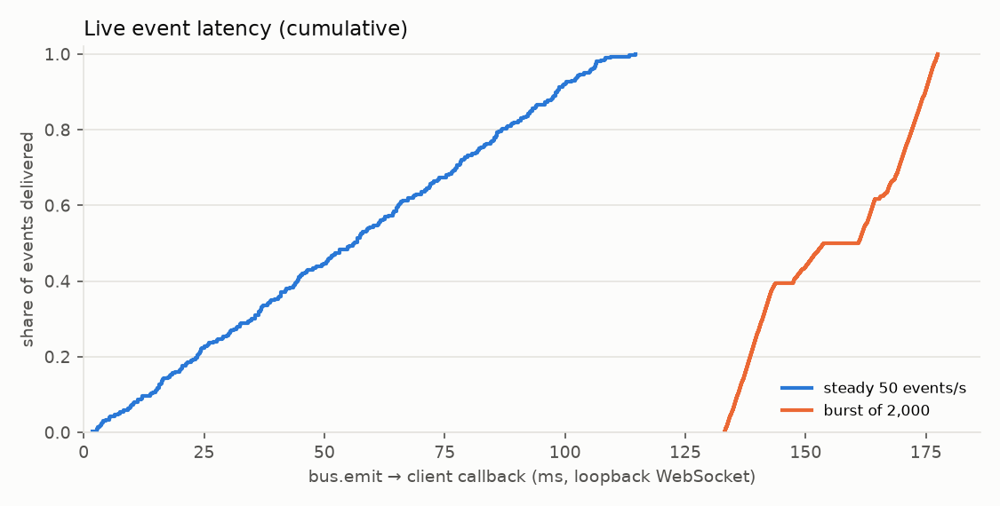

# Phase 7 evaluation (generated)

Generated 2026-10-08 08:39 UTC by `python -m app.cli evaluate` on Windows 11 (AMD64), Python 3.13.15, 32 CPUs. Every number below was measured by that run; see the CSVs in this folder for the raw rows.

* Calibration seeds: 1-10; evaluation (held-out) seeds: 11-30.
* Traffic is simulated (`app.simulation.traffic`); latencies marked *simulated time* are
  domain-time differences (attack start → event timestamp), bounded below by the 60 s window.
  Compute timings are wall-clock on the machine above.

## Threshold calibration

Rule (`harness.calibrate`): alert threshold midway between the highest score that must not
alert (benign, unknown device) and the lowest that must (vulnerable or attacked); critical
midway between the strongest single-signal attack (flood alone) and the weakest corroborated
compromise (KEV + C2, flood + C2). Automatic quarantine additionally requires observed
evidence of compromise (behavior anomaly or indicator contact): an exposure-only device can be
critical but is sent to operator review instead.

| | Phase 3 thresholds | calibrated (seeds 1-10) |
|---|---|---|
| medium | 25.0 | 13.1 |
| high | 50.0 | 19.8 |
| critical | 75.0 | 26.4 |

Calibration scores: must-not-alert max 10.0, must-alert min 16.17, single-signal max 16.38, corroborated min 36.38. Margins: alert 6.17, quarantine 20.0 points.

## Detection quality (held-out seeds)

| metric | Phase 3 thresholds | calibrated thresholds |
|---|---|---|
| attacked devices that alerted (TPR) | 66.7% | 100.0% |
| benign devices that alerted (FPR) | 0.0% | 0.2% |
| multi-signal compromises recommended for automatic quarantine | 0.0% | 100.0% |
| single-signal attacks (flood alone) recommended for automatic quarantine | 0.0% | 0.0% |
| non-attacked devices recommended for automatic quarantine | 0.0% | 0.0% |
| unknown device flagged and not quarantined | 100.0% | 100.0% |
| vulnerable-only device alerted | 100.0% | 100.0% |
| vulnerable-only device recommended for automatic quarantine | 0.0% | 0.0% |
| attack windows flagged (window TPR) | 58.7% | 58.7% |
| normal windows flagged (window FPR) | 0.19% | 0.19% |

Devices evaluated (per threshold set): {'benign': 400, 'unknown': 20, 'vulnerable': 20, 'malicious': 60}. Windows after warm-up: {'attack': 208, 'normal': 12141}.
Highest held-out score of a device that must not alert: 17.02 (calibration saw 10.0); alert threshold 13.1.
Window TPR counts every window containing an attack event, including the three single C2
contacts, which are threat-intel signals rather than behavior anomalies.

**Correlation accuracy** (each C2 contact vs. each decoy contact to a non-indicator IP; same
for both threshold sets): accuracy 100.0%, precision 100.0%, recall 100.0% (TP 40, FN 0, FP 0, TN 60).

## Latency (calibrated thresholds; p50 / p95 / max)

| scenario | first detection (s, simulated) | first alert (s, simulated) | IOC correlation (s, simulated) |
|---|---|---|---|
| unknown device | n/a | n/a | n/a |
| mqtt flood | 34 / 55 / 56 (n=20) | 34 / 55 / 56 (n=20) | n/a |
| kev ioc | 38 / 60 / 60 (n=20) | 38 / 60 / 60 (n=20) | 38 / 60 / 60 (n=20) |
| quarantine recovery | 34 / 55 / 57 (n=20) | 34 / 55 / 57 (n=20) | 34 / 55 / 57 (n=20) |
| kev only | n/a | n/a | n/a |

| measurement | p50 / p95 / max |
|---|---|
| risk assessment per device (ms, wall-clock) | 2.31 / 3.78 / 5.41 (n=500) |
| quarantine call, incl. audit + DB + status-node command (ms, wall-clock, dry-run driver) | 7.30 / 9.96 / 11.74 (n=20) |
| recovery after expiry, 60 s sweep only (s, simulated) | 23.0 / 51.8 / 56.5 (n=20) |
| unknown device discovery, first packet → DEVICE_CONNECTED (s, simulated) | 0.0 / 0.0 / 0.0 (n=20) |
| live event delivery, steady 50/s (ms, loopback WebSocket) | 56.2 / 104.0 / 114.6 (n=300) |
| live event delivery, burst of 2000 (ms, loopback WebSocket) | 157.4 / 176.1 / 177.4 (n=2000) |

Quarantine timings here use the dry-run driver; the real nftables path and device
reconnection are measured in the virtual lab below.

## Virtual lab, end to end (wall clock)

`scripts/lab_eval.py` against the running Docker lab: real packets through the gateway,
real Mosquitto, real nftables, events received over Socket.IO through nginx. 3 runs.

| measurement | run 0 | run 1 | run 2 |
|---|---|---|---|
| MQTT flood start -> ANOMALY_DETECTED on the live stream | 5.2 s | 12.0 s | 10.9 s |
| C2 beacon -> IOC_CONTACT risk assessment | 5.6 s | 12.0 s | 11.3 s |
| C2 beacon + flood -> automatic quarantine by the risk engine | 54.9 s | 57.3 s | 59.0 s |
| operator API call -> IP in the nftables set (upper bound: polled via docker exec) | 324 ms | 285 ms | 210 ms |
| release -> IP removed from the nftables set (upper bound, same polling) | 137 ms | 196 ms | 157 ms |
| quarantine expiry -> DEVICE_RESTORED (auto-recovery) | 0.1 s | 0.1 s | 0.1 s |
| release -> device's next MQTT CONNECT (whole seconds) | 4 s | 1 s | 0 s |

C2 target auto-quarantined after a single beacon: 0 of 3 runs.
An unknown device contacting a known C2 is critical with evidence of compromise, but
automatic quarantine is paused for a device an operator released within
`DSN_OPERATOR_RELEASE_GRACE_MINUTES` (30); such skips are recorded in the audit log.
Detection waits for the 60 s traffic window to close, so flood and C2 times vary with
where in the window the attack starts. Notes: none.

`lab_runs_pre_fix.csv` keeps the earlier runs that exposed a defect (fixed in 0.9.1): run 2
never re-quarantined a device that stayed critical at an unchanged score.

